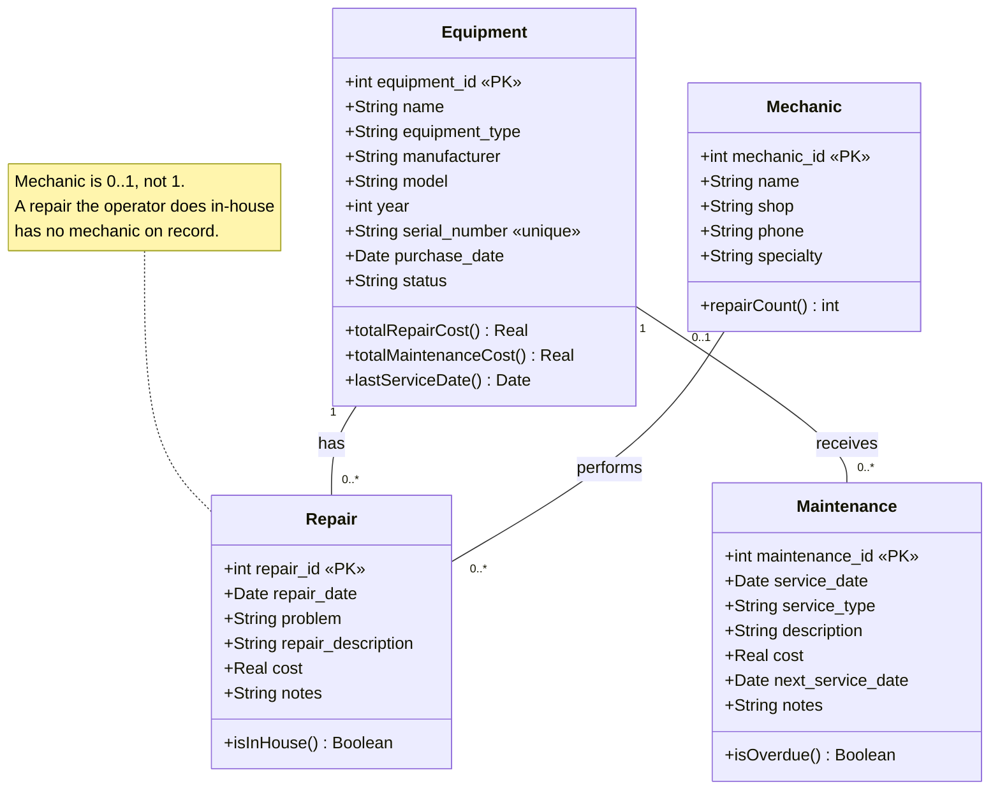
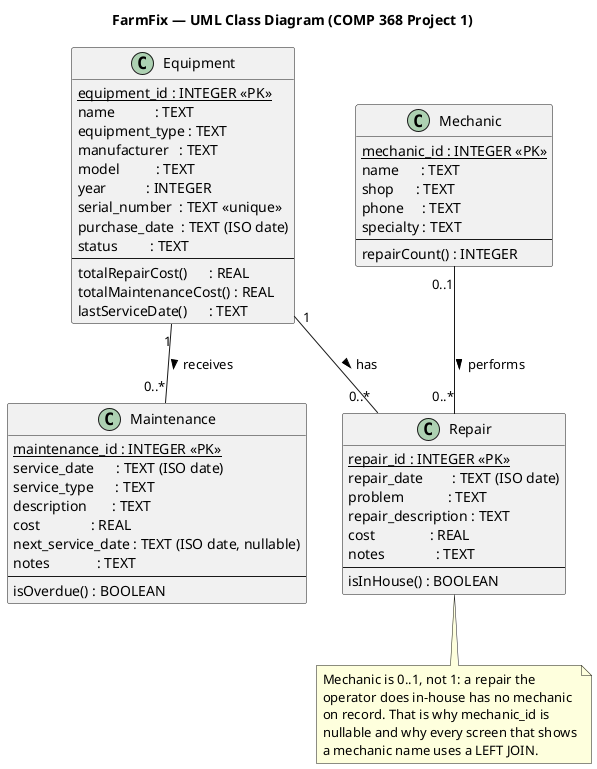

# UML Conceptual Design — FarmFix

**Course:** COMP 368 Database Systems — Project 1
**Project:** FarmFix — Farm Equipment Repair & Maintenance Tracker
**Team:** Ayush Gaire, Ashish Gaire, AJ Rayamajhi

This is a **UML class diagram**, not an ER diagram. It shows classes,
attributes, identifiers (marked `«PK»`), named associations, and
multiplicities on both ends of every association.

Rendered files in this folder: `uml-diagram.png`, `uml-diagram.pdf`,
`uml-diagram.svg`, and `uml-diagram.html` (opens in a browser, prints cleanly
to PDF).

---

## 1. Mermaid source (`classDiagram`)

This is the exact source that produced `uml-diagram.png`. The bare version,
for the `mmdc` command line, is in `uml-diagram.mmd`.



---

## 2. PlantUML source

Equivalent diagram in PlantUML, for anyone who prefers that tool. Paste into
<https://www.plantuml.com/plantuml>.



---

## 3. Reading the diagram

### 3.1 Classes and identifiers

| Class | Identifier | Attributes |
|---|---|---|
| `Equipment` | `equipment_id` | `name`, `equipment_type`, `manufacturer`, `model`, `year`, `serial_number` *(unique)*, `purchase_date`, `status` |
| `Repair` | `repair_id` | `repair_date`, `problem`, `repair_description`, `cost`, `notes` |
| `Maintenance` | `maintenance_id` | `service_date`, `service_type`, `description`, `cost`, `next_service_date`, `notes` |
| `Mechanic` | `mechanic_id` | `name`, `shop`, `phone`, `specialty` |

`serial_number` is the **natural key** of a machine — it is what is stamped on
the frame and what a dealer asks for. `equipment_id` is a **surrogate key**: an
opaque integer the rest of the schema points at, so that correcting a mistyped
serial number never means rewriting foreign keys.

### 3.2 Associations and multiplicities

| Association | Left | Right | Reading |
|---|---|---|---|
| Equipment **has** Repair | `1` | `0..*` | Every repair was performed on exactly one machine. A machine may have no repairs yet, or many. |
| Equipment **receives** Maintenance | `1` | `0..*` | Every service record belongs to exactly one machine. A machine may have no service history yet, or many entries. |
| Mechanic **performs** Repair | `0..1` | `0..*` | A repair was performed by at most one mechanic — **or by nobody on record**, when the operator did it themselves. A mechanic may have worked on many repairs, or none yet. |

### 3.3 Why the multiplicities are what they are

**Why `1` and not `0..1` on the Equipment side?** A repair or a service record
that belongs to no machine is meaningless — it could never appear in a history
or a cost roll-up. The model forbids it, and the schema enforces it with
`NOT NULL` on `equipment_id`.

**Why `0..1` and not `1` on the Mechanic side?** This is the one place the
domain pushed back on a tidier model. Farmers fix a great deal themselves: two
of the ten sample repairs are a retensioned belt and a plugged tire, done in the
shop with no invoice and no mechanic. Forcing a mechanic onto every repair would
mean inventing a fake "Self" mechanic row, which pollutes the mechanic list and
distorts every per-mechanic report. Allowing `mechanic_id` to be `NULL` says
exactly what is true: *no mechanic on record*.

That decision has a direct consequence in the SQL. Every screen that shows a
repair alongside its mechanic must use a **`LEFT JOIN`** — an inner join would
silently drop every in-house repair, and the repair totals would not match the
history.

### 3.4 Why there is no many-to-many here

Both of the core associations are genuinely one-to-many, so neither needs a
junction table. A repair happens to one machine on one day; it is not shared
between machines. Adding a junction table would let one repair belong to two
tractors, which is not true of the real world and would break the cost
roll-ups. **A junction table is the right answer to a many-to-many and the
wrong answer to a one-to-many**, so the foreign key goes on the *many* side and
nothing else is needed.

`Mechanic → Repair` might look like a candidate for one, but it is not: a repair
has at most one mechanic, not several.

---

## 4. Regenerating the diagram

- **Easiest:** paste the Mermaid block above into <https://mermaid.live> and use
  *Actions → PNG* or *SVG*.
- **PlantUML:** paste the PlantUML block into <https://www.plantuml.com/plantuml>.
- **Locally:**
  ```bash
  npm install -g @mermaid-js/mermaid-cli
  mmdc -i uml-diagram.mmd -o uml-diagram.png -w 1400 -s 2 -b white
  ```
- **PDF:** open `uml-diagram.html` in a browser and print to PDF, or use the
  `uml-diagram.pdf` already in this folder.

The mapping from these classes to the SQLite3 tables is documented in
`documentation/UML_MAPPING.md`.
